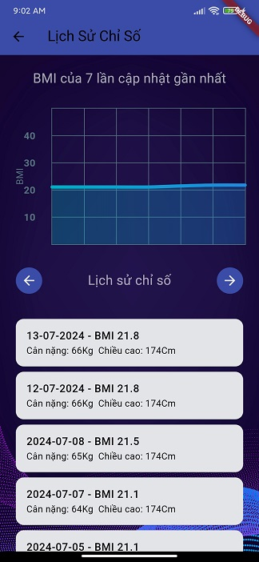
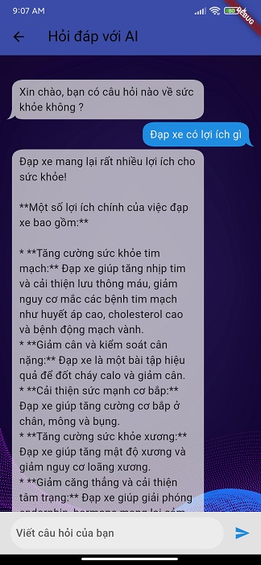
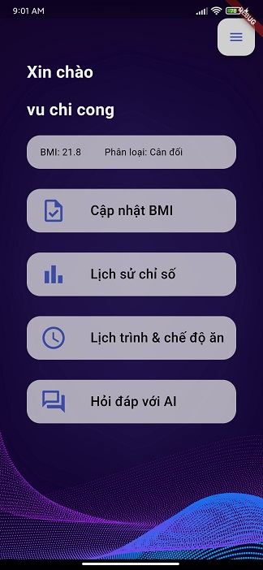
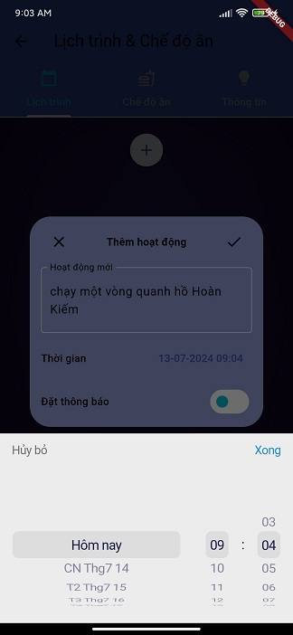

# Health Tracker

Tracking BMI, scheduling activities, building personal diet and chat bot assistant 
This app works on Android.

Main techs are used in this project :

- Flutter
- Firebase : Authentication, Firestore
- Material design
- ...and some small libraries

Here are some pictures of the app

